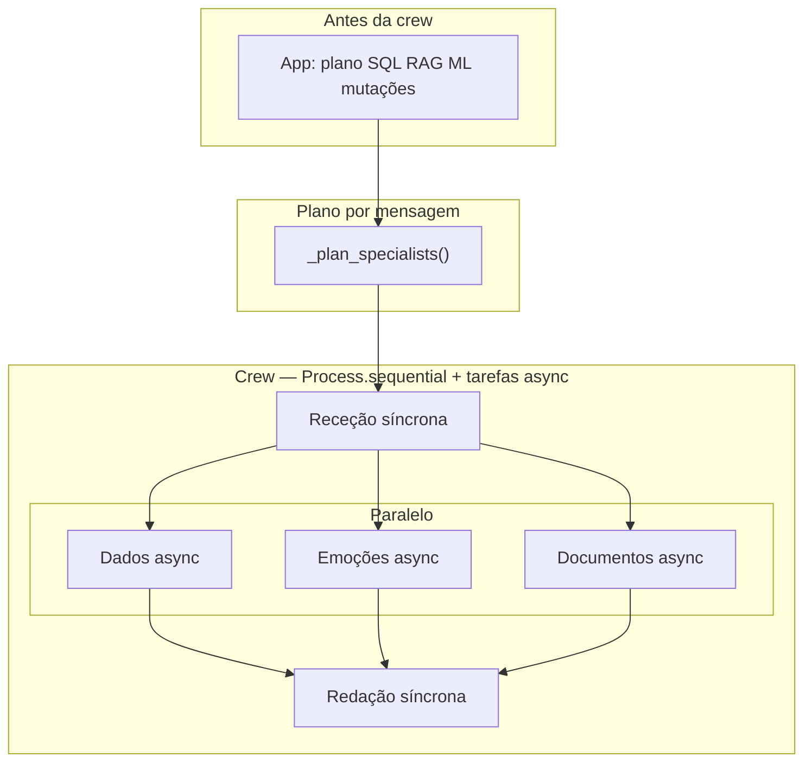

# Fluxo dos agentes CrewAI (Rotina Viva)

Documentação do fluxo implementado em [`src/modules/rotina_crew/runner.py`](../src/modules/rotina_crew/runner.py). O planeamento SQL/RAG/mutações da app **mantém-se antes** desta camada; a crew só consome o contexto já gerado e redige a resposta final.

---

## Visão geral

1. **Plano** — Heurística decide quais especialistas entram (`dados`, `ml`, `rag`), ou os três se `ROTINA_CREW_ALL_SPECIALISTS=1`.
2. **Receção** — Uma tarefa **síncrona** (“Anfitriã”): saudação + intenção explícita.
3. **Especialistas em paralelo** — Cada especialista activo corre numa tarefa com `async_execution=True`; todas usam como contexto **só** a saída da receção (não dependem umas das outras nesta fase).
4. **Redação final** — Uma tarefa **síncrona** (“Redatora”) recebe o contexto agregado das tarefas anteriores e produz **um único** Markdown para o utilizador.

No CrewAI, `Process.sequential` ordena as tarefas; o **paralelismo** dos especialistas é o comportamento **`async_execution=True`** até à próxima tarefa síncrona.

---

## Diagrama

Os ramos **Dados / Emoções / Documentos** só existem se o plano os incluir; quantos menos ramos, menos chamadas paralelas ao modelo.

---

## Agentes e tarefas

| Rótulo no log | `name` da tarefa | Papel no CrewAI (`role`) | Ferramentas |
|---------------|------------------|---------------------------|-------------|
| **Receção** | `recepcao` | Anfitriã — boas-vindas | — |
| **Dados** | `analista_dados` | Analista de dados (DuckDB) | SELECT validado DuckDB |
| **Emoções** | `especialista_ml` | Especialista ML emoções | Classificação ML local |
| **Documentos** | `especialista_rag` | Especialista RAG (documentos) | Consulta índice Chroma *(se coleção existir)* |
| **Redação** | `redatora_final` | Redatora — síntese final | — |

Implementação auxiliar das ferramentas: [`src/modules/rotina_crew/tools.py`](../src/modules/rotina_crew/tools.py).

---

## Plano (`dados` / `ml` / `rag`)

- **`ROTINA_CREW_ALL_SPECIALISTS=1`** — activa sempre os três especialistas (ignora heurísticas).
- **Caso contrário** — combinam-se:
  - palavras-chave no texto do utilizador;
  - presença de blocos já preenchidos (tabular grande, **RAG real** — o placeholder `(busca em documentos não solicitada)` não conta como RAG), addon ML;
  - `predictive_ml` ligado ou `collection` disponível onde aplicável.

Se nenhum especialista ficar marcado por heurística, há **fallback** (prioridade: bloco tabular → RAG → ML → dados por defeito). O campo `reason` na linha de log `kickoff` documenta o motivo.

---

## Logs (`rotina.crew`)

Correlacionar todas as linhas do **mesmo** pedido pelo **`req=`** (12 caracteres hex).

| Mensagem típica | Significado |
|-----------------|-------------|
| `kickoff \| plan=dados+ml+… \| parallel=N \| reason=…` | Quem foi incluído no plano paralelo (`N` = número de especialistas). |
| `execute \| … \| mode=recepcao_serial_depois_especialistas_paralelo` | Início efectivo da crew com este modelo de execução. |
| `trace \| agent=Receção \| …` (idem Dados, Emoções, …) | Saída resumida por agente (`ROTINA_CREW_LOG_FULL` muda para `trace_full` com texto completo). **Uma linha por tarefa** — em ordem típica: Receção, especialistas em paralelo, depois Redação. |
| `traces_order \| steps=N \| Receção → … → Redação` | Resumo numa linha da **ordem e contagem** de passos (confirma que Recepção e Redação entram nos logs). |
| `done \| ms=…` | Tempo total deste `req=`. |

**Terminal:** `docker logs -f rotina-viva` e filtro por `[rotina.crew]` ou `req=`.

**Docker Desktop:** abra **Containers** (ícone lateral ou **View → Containers**), clique no contentor **rotina-viva** e use o separador **Logs**. Dá para procurar no campo de pesquisa (se existir na sua versão) por `rotina.crew` ou pelo `req=`.

Para acentos estáveis nos logs dentro do contentor (e na maior parte dos terminais), a imagem define `LANG`/`PYTHONUTF8`/`PYTHONIOENCODING` no `Dockerfile`; ao correr Streamlit/Crew direto no Windows, mantenha o terminal em UTF-8 (`chcp 65001` no cmd ou terminal moderno Unicode).

---

## Variáveis de ambiente relevantes

| Variável | Efeito |
|----------|--------|
| `ROTINA_CREW_ALL_SPECIALISTS` | `1` / `true` — força Dados + Emoções + Documentos em todas as mensagens. |
| `ROTINA_CREW_LOG_FULL` | `1` / `true` — regista output completo de cada tarefa (`trace_full`). |

LLM/API: igual ao chat OpenAI-compatível (`ROTINA_CHAT_PROVIDER`, chaves, `OPENAI_CHAT_MODEL`, etc.), visto [`src/modules/rotina_crew/llm_factory.py`](../src/modules/rotina_crew/llm_factory.py).

---

## Interface Streamlit

- Secção lateral: **CrewAI — multi-agente (paralelo)**; checkbox para activar Crew em vez do streaming único (quando há dependências e API compatível).
- O detalhe por agente **não** é mostrado na UI; usar logs do contentor conforme acima.

---
w
## Ficheiros relacionados

| Ficheiro | Função |
|----------|--------|
| `src/modules/rotina_crew/runner.py` | Agentes, tarefas, plano, `kickoff()`, logging |
| `src/modules/rotina_crew/tools.py` | DuckDB / ML / RAG como ferramentas |
| `src/modules/rotina_crew/llm_factory.py` | LLM CrewAI ↔ env da app |
| `src/ui/components.py` | Checkbox e chamada `run_rotina_crew_chat` |
