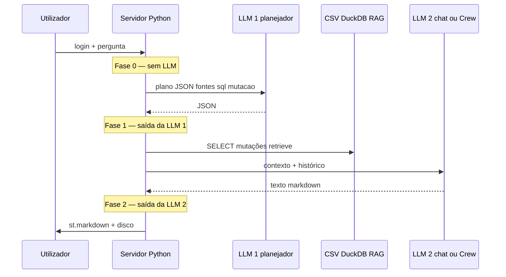
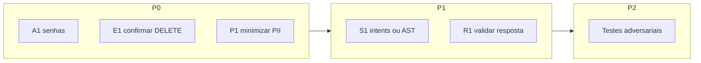

# Relatório de segurança — uso de LLM no Rotina Viva

**Data:** 2026-05-23 (revisão 2)  
**Âmbito:** Streamlit + `modules/ai_engine.py` + CrewAI + RAG + DuckDB/CSV.  
**Modelo de ameaça:** utilizadores autenticados (gestão, educador, família); compromisso de credenciais, PDFs indexados ou fornecedores de API.

---

## Como ler este documento

### Pipeline real (evita ambiguidade “antes / depois da LLM”)

Cada mensagem do utilizador pode acionar **várias** chamadas ao modelo. Os riscos abaixo estão agrupados por **momento no fluxo**, não por “uma LLM única”.



| Fase | O que acontece | Secção do relatório |
|------|----------------|---------------------|
| **0 — Pré-modelo** | Autenticação, montagem da pergunta, ML local, eventual tradução | §1 |
| **1 — Pós-planeador** | Execução de SQL/mutações e RAG com base no JSON da LLM 1 | §2.1 |
| **2 — Pós-chat** | Texto final (stream/Crew) até ecrã e persistência | §2.2 |

Chamadas adicionais (embeddings RAG, Whisper, tradução de emoções) seguem a mesma lógica da §1: tudo o que **entra** no payload do provedor.

### Três categorias (sem confundir produto com falha)

| Categoria | Significado | Exemplo |
|-----------|-------------|---------|
| **Decisão de produto** | Comportamento intencional para o perfil certo | Gestão pode pedir DELETE no chat; educador não |
| **Controlo existente** | Código que limita dano | `validate_mutation_sql`, `allow_delete_mutations` |
| **Risco residual** | O que ainda pode correr mal | Conta gestão roubada; modelo inventa dados na resposta |

**Importante:** instruir o planeador a “não recusar DELETE” para gestão **não contradiz** a segurança — é alinhamento do modelo com regras já definidas no servidor. O risco aparece se se assumir que **só o texto do prompt** protege os dados (não protege) ou se a conta de gestão for abusada.

### O que não é risco de LLM (fora de âmbito detalhado)

- Segurança física da escola, rede Wi‑Fi dos pais, backup off-site não gerido pela app.
- Ataques que exijam comprometer o servidor sem passar pelo login (hardening de SO/Docker é operação, não coberta linha a linha aqui).

---

## 1. Riscos antes do conteúdo chegar ao provedor de LLM (Fase 0)

Inclui: login, dados que serão serializados no prompt, primeira chamada (`llm_plan_sources`), embeddings, Whisper e tradução auxiliar.

### 1.1 Autenticação, sessão e abuso

| ID | Risco | O que acontece no código | Por que deve importar |
|----|--------|---------------------------|------------------------|
| A1 | **Senhas sem hash** | `check_password()` compara texto plano em `rotina_users.json` | Qualquer cópia do JSON (backup, USB, repositório mal configurado) expõe **todas** as contas de uma vez; responsáveis e staff partilham o mesmo tipo de falha. |
| A2 | **Sessão na URL** | `?rotina_session=<uuid>` restaura login após F5 | Token em histórico do browser, screenshots ou logs de proxy permite **sessão roubada** sem saber a senha — acesso ao diário de crianças. |
| A3 | **Autorização só no servidor (correto), mas invisível ao utilizador** | RBAC via `allow_mutations` / `allow_delete`; o modelo recebe texto de perfil, não “login” | Se a UI ou a equipa interpretarem “a IA recusou” como garantia legal, há falsa sensação de segurança; o que importa é o **código**, não a cortesia do modelo. |
| A4 | **Sem quota por utilizador** | Retries HTTP 429; sem teto por conta | Conta comprometida ou utilizador a testar em loop gera **custo de API** e permite **extrair muitos registos** via perguntas repetidas. |

### 1.2 Privacidade e PII no payload

| ID | Risco | O que entra no provedor (OpenRouter/OpenAI/Ollama, etc.) | Por que deve importar |
|----|--------|----------------------------------------------------------|------------------------|
| P1 | **Dados de menores no `duck_block`** | Nome, turma, alergias, `contato_pais`, diário (refeições, sono, medicamentos) | **LGPD/RGPD**: dados de crianças são sensíveis; envio a terceiros exige base legal, DPA e transparência para pais/escola. Multa e dano reputacional. |
| P2 | **Histórico de conversa** | Planeador: últimas 12 mensagens, cada uma até 1800 caracteres; chat final: histórico **sem** esse limite por mensagem | Perguntas antigas (incluindo nomes de outras crianças ou incidentes) **voltam** ao provedor mesmo na pergunta atual. |
| P3 | **Áudio (Whisper)** | Voz convertida em texto e reenviada ao pipeline | Gravações podem identificar criança e contexto familiar; mesmo risco de P1 se o serviço for cloud. |
| P4 | **Observabilidade (Langfuse)** | Com chaves configuradas, default `ROTINA_LANGFUSE_ENABLED=true` regista input/output truncados | Cria **segunda cópia** dos prompts fora da escola; útil para debug, perigoso sem mascaramento e contrato. |
| P5 | **Fallbacks Google** | SpeechRecognition / `deep-translator` em falhas | Dados podem ir para serviços **não previstos** no contrato com a escola se o `.env` não desligar fallbacks. |
| P6 | **Embeddings da pergunta RAG** | Texto da pergunta (e reforço do aluno no perfil família) enviado ao modelo de embedding | Metadado que revela intenção e, no perfil família, vínculo ao aluno — mesmo quando o PDF é institucional. |

**Nota sobre perfil família:** `apply_parent_sql_scope` e instruções de sistema **reduzem** vazamento na consulta; não eliminam P1/P2 — o filho continua identificável no prompt e o histórico pode alargar o contexto.

### 1.3 Prompt injection e dados não confiáveis no contexto

| ID | Risco | Vetor | Por que deve importar |
|----|--------|-------|------------------------|
| I1 | **Injection directa** | Texto livre do utilizador no planeador e no chat | Utilizador (ou atacante com login) pode tentar alterar roteamento, pedir SQL destrutivo no JSON ou extrair instruções internas. |
| I2 | **Injection indirecta** | Trechos de PDF (`rag_block`) ou células CSV no `duck_block` | Documento ou cadastro maliciosamente preenchido age como “instrução escondida”; difícil de auditar porque parece dado legítimo. |
| I3 | **Persistência no histórico** | Turnos anteriores reenviados | Um jailbreak bem-sucedido na mensagem 3 pode influenciar a mensagem 10. |
| I4 | **Instrução de gestão no planeador** | `planner_suffix_gestao_mutation_permission_note()` pede ao modelo que planeie mutações sem recusa genérica | **Não é bug:** alinha o planeador com perfil gestão. **Risco:** se interpretado como única barreira, ou com conta gestão roubada, facilita planos de DELETE — a barreira real continua a ser `validate_mutation_sql` + `allow_delete_mutations`. |

Mitigações atuais (parciais): `system_persona`, `system_grounding`, `system_sql_strict`; heurísticas (nutrição → RAG; incidente emocional → RAG). **Não há** separação estrutural forte entre “dados” e “instruções” nem filtro automático de jailbreak.

### 1.4 Planeador: modelo sugere SQL (ainda na Fase 0 — saída será usada na Fase 1)

| ID | Risco | Detalhe técnico | Por que deve importar |
|----|--------|-----------------|------------------------|
| S1 | **SQL gerado por regex** | `validate_sql` / `validate_mutation_sql` bloqueiam palavras e padrões, não analisam AST completa | Bypasses subtis ou SELECT muito largo podem passar; confiança excessiva no validador gera falsa segurança. |
| S2 | **Promoção `sql` → `mutacao`** | `promote_plan_sql_mutation_field` corrige formato do JSON | Boa para UX; exige que o validador de mutação seja sempre executado (hoje é — desde que `allow_mutations` esteja correto). |
| S3 | **Schema completo no prompt** | `schema_duckdb_for_llm()` lista colunas | Facilita respostas certas, mas ensina ao modelo (e a quem interceptar tráfego) **onde está cada dado sensível**. |
| S4 | **Falha do planeador** | Erros podem degradar roteamento (ex. só RAG) | Respostas erradas ou incompletas — risco **operacional** (decisões pedagógicas) mais que confidencialidade. |
| S5 | **CrewAI — tools só leitura** | `consultar_tabelas_escolares` usa `validate_sql`; mutações ficam no fluxo clássico antes do Crew | Menos superfície nas tools; mutação crítica continua no plano JSON + `ui/components.py`. |

### 1.5 Segredos, custo e terceiros

| ID | Risco | Por que deve importar |
|----|--------|------------------------|
| K1 | **Chaves API no `.env`** | Vazamento em imagem Docker, CI ou log = uso fraudulento da conta OpenRouter e possível leitura de dados enviados. |
| K2 | **CrewAI = várias chamadas por turno** | Custo multiplicado; mais superfície para injection e vazamento em traces Langfuse. |
| K3 | **Sem CAPTCHA / limite por IP** | App interna: risco sobretudo após A2 ou A1. |

---

## 2. Riscos depois da LLM produzir saída (Fases 1 e 2)

### 2.1 Fase 1 — Saída do **planeador** (JSON) até à segunda chamada

Estes riscos começam quando o modelo devolve `{"fontes", "sql", "mutacao"}`. O utilizador **ainda não viu** a resposta final, mas o sistema já pode alterar dados.

| ID | Risco | O que o servidor faz | Por que deve importar |
|----|--------|----------------------|------------------------|
| E1 | **Mutação antes da resposta** | `run_mutation_and_persist` grava CSV se JSON passar validação e RBAC | Pedido ambíguo ou conta gestão abusada pode **apagar ou corromper cadastro real** antes de qualquer revisão humana na mensagem do chat. |
| E2 | **SELECT demasiado largo** | `run_safe_select` após plano; família com `apply_parent_sql_scope` | Falha de filtro (homónimos, SQL criativo) carrega **outras crianças** no `duck_block` que alimentará a 2.ª LLM e o ecrã. |
| E3 | **Confirmação só por texto** | Mutações não passam por diálogo “confirmar DELETE” na UI | Um único enter após frase mal interpretada pode ser irreversível sem backup. |

**Separação clara:** E1–E3 não são “alucinação na resposta” — são **efeitos colaterais** da confiança no plano JSON. O controlo existente (`allow_delete_mutations`, duplicados bloqueados, etc.) limita mas não elimina E1.

### 2.2 Fase 2 — Saída do **chat / Crew** até ao utilizador

| ID | Risco | O que acontece | Por que deve importar |
|----|--------|----------------|------------------------|
| R1 | **Alucinação factual** | Modelo inventa refeições, turmas ou ids não presentes em `duck_block` | Pais ou educadores podem **agir** (reclamar, medicar, mudar rotina) com base em informação falsa — risco de bem-estar da criança e confiança na escola. |
| R2 | **Excesso de PII na resposta** | Sem redacção: modelo pode repetir telefone, alergias de vários alunos | Violação de minimização LGPD; exposição a quem partilha ecrã ou imprime chat. |
| R3 | **Vazamento de prompt / plano** | Modelo pode ecoar instruções internas ou JSON | Expõe lógica interna e facilita ataques seguintes (I1). |
| R4 | **Conteúdo inadequado** | Só system prompt define tom; sem filtro pós-modelo | Respostas insensíveis em incidentes emocionais ou conselhos médicos indevidos — risco reputacional e de duty of care. |
| R5 | **Markdown / links** | `st.markdown` / stream sem sanitização explícita de HTML | Risco baixo a moderado de XSS ou phishing dependendo da versão Streamlit e do conteúdo gerado. |
| R6 | **Truncamento por tamanho** | `ROTINA_CHAT_MAX_OUTPUT_CHARS` (default 4500) | Corta texto no meio — confusão operacional, não confidencialidade; pode omitir avisos importantes no fim da resposta. |
| R7 | **Persistência local** | `data/.rotina_chat/<uuid>.json` com mensagens e dono | Disco roubado ou backup mal protegido = histórico completo de conversas sobre crianças. |
| R8 | **Réplica em Langfuse** | Output da geração guardado (truncado) | Mesmo impacto que P4, na fase de resposta. |
| R9 | **Resposta determinística de mutação** | `build_mutation_direct_reply` evita contradição do modelo | Reduz R1 após mutação, mas pode ainda citar linhas de verificação SQL — controlar o que entra em `duck_block` de verificação. |

**CrewAI:** vários agentes e logs (`ROTINA_CREW_LOG_FULL`) amplificam R2/R7/R8 se activados em produção.

---

## 3. Plano de tratativas (alinhado aos IDs)

Prioridade: **P0** (dias–semanas, alto impacto) → **P1** → **P2**.

| Prioridade | IDs alvo | Tratativa | Notas |
|------------|----------|-----------|--------|
| P0 | A1 | Hash de senhas (bcrypt/argon2) + migração no login | Elimina exposição em massa no JSON. |
| P0 | A2 | Cookie HttpOnly + rotação; evitar token só na query string | Reduz hijack de sessão. |
| P0 | P1, P2, P6 | Minimização no prompt: colunas necessárias, mascarar `contato_pais`, limitar histórico no chat final | Reduz superfície LGPD. |
| P0 | P1, P4, P5, P8 | DPA com provedor; modo Ollama local documentado; Langfuse opt-in + mascaramento; desligar fallbacks Google em produção | Controlo de subprocessadores. |
| P0 | E1, E3 | Confirmação explícita na UI para DELETE/UPDATE em massa; backup CSV automático antes de mutação | Proteção contra erro humano + E1. |
| P0 | E1 | Auditoria append-only (quem, SQL, timestamp) **sem** reenviar log à LLM | Accountability e investigação. |
| P0 | A4, K2 | Quota diária por utilizador + alerta de custo | Abuso e fraude. |
| P1 | I1–I3, S1 | Delimitadores dados/instruções; scanner leve de jailbreak; parser SQL (AST) ou intents tipados em vez de SQL livre | Reduz injection e S1. |
| P1 | R1, R2 | Validador pós-LLM: entidades citadas ⊆ linhas SQL; redacção opcional de telefones | Mitiga dano de R1/R2 sem bloquear chat. |
| P1 | I4, E1 | Manter instrução de gestão no planeador **e** reforçar que só código executa; testes automatizados educador→DELETE rejeitado | Esclarece “não paradoxo”: duas camadas. |
| P1 | R5 | `unsafe_allow_html=False`; validar esquemas de URL | XSS/phishing. |
| P2 | R4 | Política de recusa determinística para temas médicos/legais fora de escopo | Duty of care. |
| P2 | R7, K1 | Criptografia em repouso para `data/`; rotação de chaves; secrets fora da imagem | Roubo de disco. |
| P2 | todos I*, S* | Suite de testes adversariais (injection, PDF, homónimos, perfil família) | Regressão contínua. |



---

## 4. Controles já existentes (não substituem o plano)

| Controlo | Limita | Não elimina |
|----------|--------|-------------|
| Login + perfis | Acesso anónimo | A1, A2, utilizador mal-intencionado autenticado |
| `validate_sql` / `validate_mutation_sql` | Muitos SQL óbvios | S1, E1 com conta gestão |
| `allow_delete_mutations` / `read_only_db` | DELETE e mutações por perfil | E1 se perfil gestão |
| `apply_parent_sql_scope` | SQL família | E2 por homónimos ou histórico P2 |
| System prompts + `build_mutation_direct_reply` | Tom e contradições pós-mutação | R1, R4 |
| Truncamento planeador 12×1800 | Tamanho no planeador | P2 no chat final |
| LLM só no servidor | Exposição de API key no browser | K1 no servidor |
| `.gitignore` de `.rotina_chat/` | Commit acidental | R7 em disco de produção |

---

## 5. Referência de código

| Ficheiro | Papel |
|----------|--------|
| `modules/ai_engine.py` | Prompts, planeador, stream, limites de histórico |
| `ui/components.py` | Pipeline UI, mutações, Crew |
| `core/database.py` | Validação SQL, persistência de chat |
| `core/auth_manager.py` | Login, RBAC, sufixo gestão no planeador |
| `modules/chat_service.py` | Escopo família, respostas determinísticas |
| `modules/langfuse_rotina.py` | Observabilidade (`ROTINA_LANGFUSE_ENABLED` default `true`) |
| `modules/rotina_crew/` | Multi-agente e tools de leitura |

---

## 6. Glossário rápido

| Termo | Significado neste projeto |
|-------|---------------------------|
| **Planeador** | 1.ª chamada LLM → JSON com fontes/SQL/mutação |
| **Chat final** | 2.ª chamada (stream ou Crew) → markdown ao utilizador |
| **RBAC** | Regras por perfil aplicadas em Python; texto no prompt apenas alinha o modelo |
| **PII** | Dados que identificam criança ou responsável (nome, contacto, diário, etc.) |
| **Prompt injection** | Texto que tenta mudar o comportamento do modelo fingindo ser dado ou instrução legítima |

---

*Revisão estática do repositório. Validar com testes de intrusão focados em perfil família, homónimos e conta gestão comprometida.*

---

## 7. Implementação (2026-05-23)

Tratativas P0/P1 integradas no código — ver exemplos visuais em [`SEGURANCA_ANTES_DEPOIS.md`](SEGURANCA_ANTES_DEPOIS.md).

| ID | Implementação |
|----|----------------|
| A1 | `core/security.py` + migração bcrypt no login (`core/auth_manager.py`) |
| A2 | Token em `session_state`; URL opcional (`ROTINA_SESSION_IN_URL`); remoção de `?rotina_session=` após consumo |
| A4 | `ROTINA_LLM_DAILY_MESSAGES_PER_USER` + ficheiro em `data/.rotina_usage/` |
| P1/P2 | `mask_pii_in_duck_block`, `trim_history_for_chat` no chat |
| P4 | Langfuse default `false`; `mask_messages_for_observability` |
| P5 | `ROTINA_ALLOW_GOOGLE_STT=false`; `ROTINA_EMOTION_TRANSLATE_FALLBACK=0` |
| I1 | `scan_user_message` na UI |
| I2 | `wrap_untrusted_data_block` em `ai_engine` |
| E1/E3 | Confirmação DELETE + `backup_csv_tables_before_mutation` + `append_mutation_audit` |
| R2 | `redact_sensitive_output` + aviso de alucinação heurístico |

Testes no **host**: `python tests/test_security_rotina.py`

**Docker** (recomendado se usa `docker compose`):

```powershell
docker compose build rotina-viva
docker compose up -d
.\scripts\run-security-tests-docker.ps1
```

Ou: `docker compose exec rotina-viva python tests/test_security_rotina.py`
